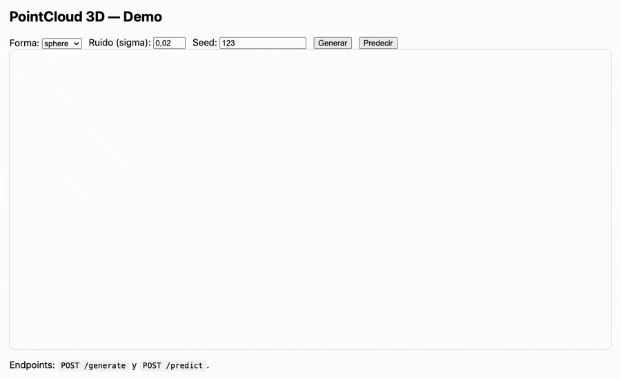

# pointcloud-mlops-pocket

Mini proyecto MLOps “de bolsillo” para **clasificación de nubes de puntos 3D** (datos sintéticos con ruido) con:
- Generación de nubes 3D (sphere/cube/cylinder/cone/torus)
- Visualización **Plotly** en navegador
- Entrenamiento local o en Docker (baseline **RandomForest**)
- API **FastAPI** con endpoints `/generate`, `/predict` y demo `/demo`
- Artefactos versionados en `artifacts/models/<version>` y alias `artifacts/models/current`

> Objetivo: proyecto pequeño pero “portfolio-ready”, reproducible y fácil de ejecutar.

---

## Demo



Abra el demo en:
- `http://localhost:8000/demo`

---

## Requisitos

### Con Docker
- Docker Desktop / Docker Engine con `docker compose`

### Sin Docker (local)
- Python 3.12+
- `uv` (gestor de entorno/depencias)
- (Opcional) VS Code

---

## Quickstart en Docker

Desde la raíz del repo:

1) Entrenar (genera el modelo en `./artifacts`)
```bash
docker compose -f docker/docker-compose.yml run --rm train
```

2) Levantar la API
```bash
docker compose -f docker/docker-compose.yml up --build api
```

3) Abrir
- Demo: http://localhost:8000/demo
- Estado: http://localhost:8000/health
- Docs: http://localhost:8000/docs
> Nota: el contenedor api monta ./artifacts como volumen. Si no ha entrenado antes, /predict devolverá 503.

---

## Quickstart local (sin Docker)
1) Crear entorno e instalar dependencias
```bash
uv venv
uv sync --all-extras --dev
```

2) Entrenar (crear artefactos en `./artifacts`)
```bash
uv run python scripts/train.py --config configs/train.yaml
```

3) Arrancar la API
```bash
export MODEL_DIR="artifacts/models/current"
uv run uvicorn pointcloud_mlops.main_api:app --reload
```

4) Abrir
- `http://localhost:8000/demo`

---

## Uso de la API
1) Generar nube 3D (y previsualizarla)
POST `/generate`
Ejemplo:
```bash
curl -s http://localhost:8000/generate \
  -H "Content-Type: application/json" \
  -d '{"shape":"torus","n_points":512,"noise_sigma":0.02,"seed":123,"apply_random_rotation":true}'
```
Respuesta:
- points: lista `[[x,y,z], ...]`
- plotly_json: figura Plotly (opcional; el demo renderiza desde `points`)

2) Predecir clase a partir de puntos
POST `/predict`
Ejemplo (a partir de un modelo entrenado):
```bash
curl -s http://localhost:8000/predict \
  -H "Content-Type: application/json" \
  -d '{"points":[[0,0,0],[1,0,0],[0,1,0],[0,0,1],[1,1,0],[1,0,1],[0,1,1],[1,1,1],[0.5,0.5,0.5],[0.2,0.1,0.3],[0.9,0.8,0.7],[0.3,0.7,0.2],[0.6,0.1,0.9],[0.1,0.9,0.4],[0.8,0.2,0.2],[0.2,0.8,0.9]]}'
```

Respuesta:
- `predicted_class`
- `probabilities` (por cada clase)
- `model_version`
- `plotly_json`(figura con título "Predicted: ...")

3) Salud del servicio
GET /health
Indica si hay modelo cargado y la versión.

---

## Entrenamiento y artefactos
El entrenamiento usa datos sintéticos generados con:
- rotación aleatoria 3D
- escalado aleatorio
- traslación ligera
- ruido gaussiano (sigma configurable)

Configuración principal:
- `configs/train.yaml`

Salidas:
- `artifacts/models/<YYYYMMDD-HHMMSS>/model.joblib`
- `artifacts/models/<YYYYMMDD-HHMMSS>/metadata.json`
- `artifacts/models/current/` (alias del último modelo)
- `artifacts/reports/report.json` (métricas y resumen)

---

## Estructura resumida del repositorio
- `src/pointcloud_mlops/`: código principal (API, core, services, adapters)
- `scripts/`: entrenamiento y utilidades
- `configs/`: YAML de entrenamiento/predicción
- `docker/`: Dockerfile y docker-compose
- `tests/`: unit + integration
- `artifacts/`: modelos y reportes (no se versiona en git)
- `docs/`: documentación y recursos (capturas/GIF)

---

## Desarrollo (calidad)
Lint y formato:
```bash
uv run ruff format .
uv run ruff check .
```

Tests:
```bash
uv run pytest -q
```
---

## Troubleshooting
`/predict`devuelve 503 "Model not available"
- Entrene primero: `docker compose ... tun --rm train`o `uv run python scripts/train.py`
- Asegúrese de que existe: `artifacts/models/current/model.joblib`
- Verifique `MODEL_DIR` (en local) o el volumen `./artifacts:/app/artifacts` (en Docker)

En `/demo`no se ve la nube
- Pruebe `http://localhost:8000/docs`
- Revise consola del navegador (F12)
- Compruebe que Plotly/WebGL funciona (en Chrome, aceleración por hardware activada)

---

## Licencia
Apache-2.0
